# Assignment Day 1

This project is created to explore the way to exploit the security vulnerabilities. This is in reference to the assignmnet as menntioned in Day 1 Assignment

## Use Case #
The development team has shipped a new internal build of OWASP Juice Shop and it needs to be reviewed across six OWASP Top 10 categories before it progresses to UAT. Your job is to test the new build for various vulnerabilities.

## Broken Access Control and Injection ##
### Post a product review as another user or edit any user’s existing review. ##

#### Steps to Reproduce ####

1. Login as User A. I have used the user test@yopmail.com and post the review for any product.
2. Edit the posted review and capture the PATCH request
3. Capture the GET request to fetch the reviews and associated IDs
4. Edit the request body of PATCH API. Update the id with some other review which is different than the comment posted by user A. 

#### Execution Screenshot: ####
1. PATCH request of User A
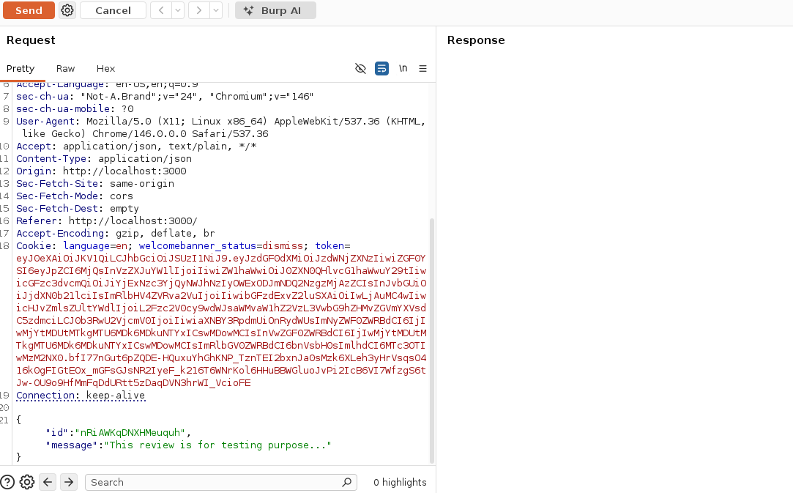

2. GET reviews request
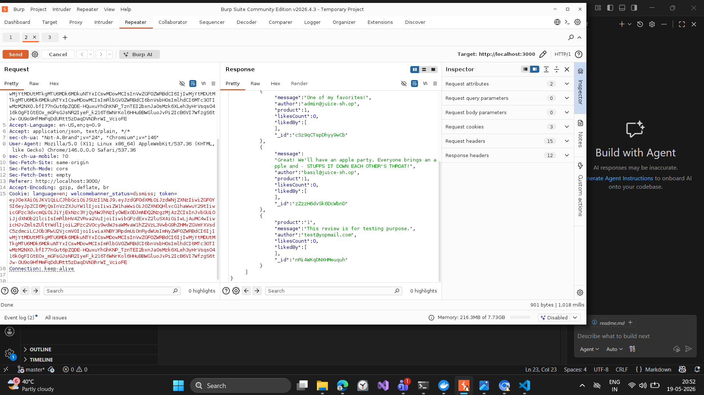

3. Edited some random user comment (other than user A) with success response
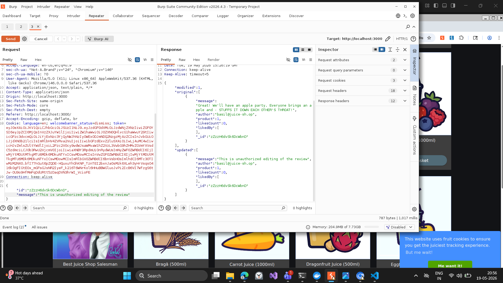
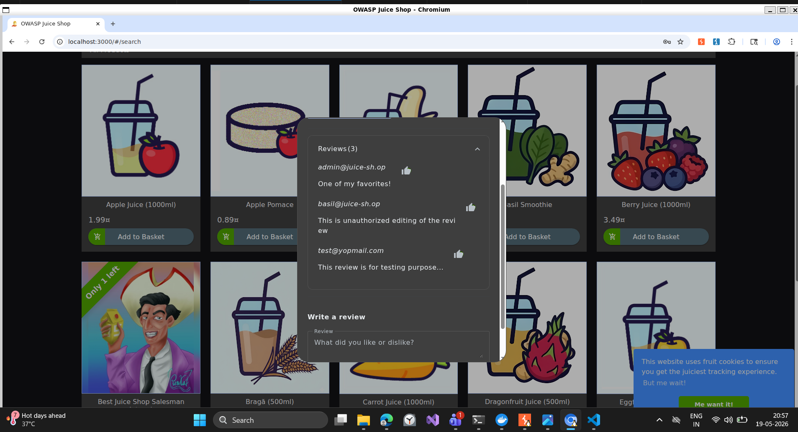

#### Summary ####
Here, the application fails to validate if a user is authorised to perform certain operation on an application. In this scenario, the application validates only if the user is authenticated or logged in, but it doesn't check if the user has an access to edit the comment with id that doesn't concern the currently authenticated user.
This is an example of Broken Access Control and it can lead to major consequences such as unauthorised data update, data integrity issues etc.

### Access the administration section of the store and delete all the 5-star reviews ###

#### Steps to Reproduce ####
1. Login a user with id: ' OR 1=1-- and some jibberish string as a password
2. Redirect to /administration
3. Delete any of the review. As per the task, we have deleted the 5 star review

#### Execution Screenshot ####
1. Unauthorised Login as Admin and Redirection to Admin Control Board
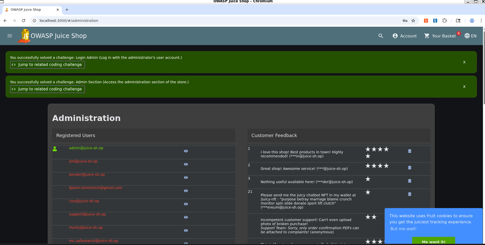

2. Delete the 5 star reviews
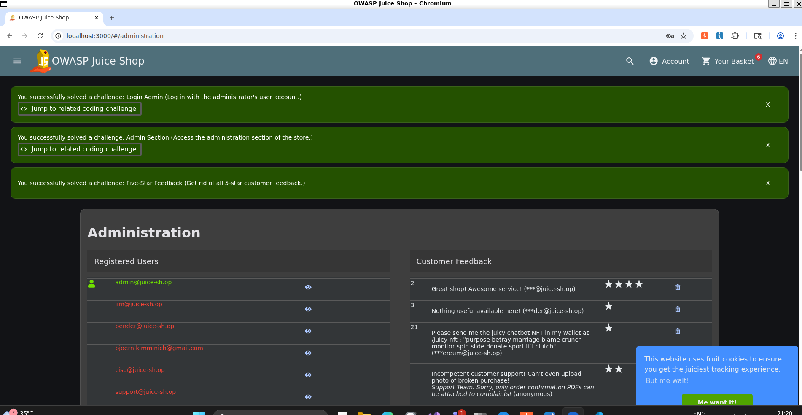

#### Summary ####
This is an example of Vertical Privilege Escalation where a user access the admin rights or priviliges and perform operation which is authorised for the user above the hierachy of current user. In this scenario, an application fails to identify the user and logged it via query (|| 1=1) which evaluates to true and returns probably the default value. 
Apart from that the user is also able to perform the operations that are exclusive to the users with certain access/privliges indicating that the access or abstraction is not enforced correctly.

## Security Misconfiguration ##
### HTTP Security Headers Inspection ###

#### Findings ####

| Header | Available | Value |
| ------ | ------ | ------ |
| **X-Frame-Options**   | Yes  | SAMEORIGIN |
| **Content-Security-Policy** | No | - |
| **Strict-Transport-Security** | No | - |
| **X-Content-Type-Options** | Yes | nosniff |
| **Permissions-Policy** | No | - | 

#### Observation ####
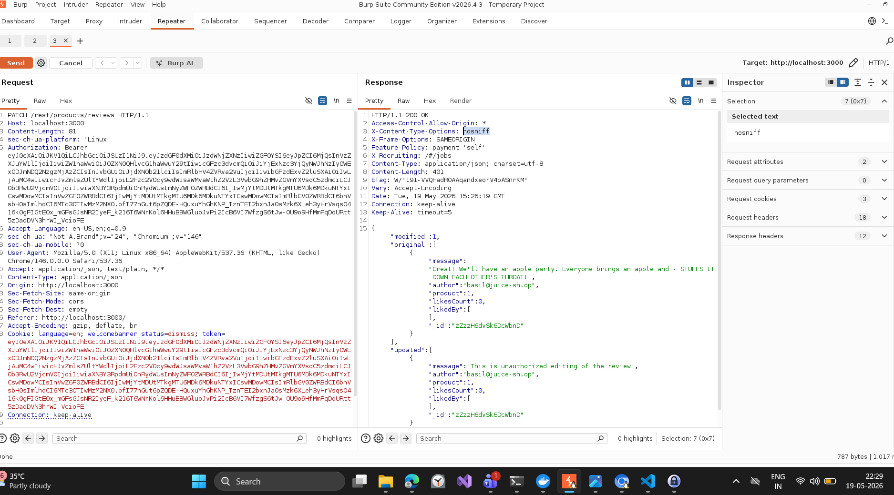

#### Security Impact ####

- **X-Frame-Options** Here, we have X-Frame-Options as SameOrigin which restricts the attacker to initiate the attack via clickjacking. In this, a legit application is being opened in a frame with malicious content. If we have same-origin value set for X-Frame-Options, this will protect an application from being embedded in frames.

- **Content-Security-Policy** This header convey the browser about the allowed domains,scripts or content. If we do not have any value set for this header, it will let attacker executes the malicious Javascript or content. This can lead to security exploitation for the application.

- **Strict-Transport-Security**  HTTPS connection are secure and encrypted. The user is not able to intercept or modify the traffic. If we do not have Security Transport Policy, it will redirect to HTTP and the traffic can be easily intercepted.

- **X-Content-Type-Options** If we set the value as nosniff, the browser will only allow the content with specified type. Suppose, a user uploads some file with extension .pdf or .jpg with some malicious Javascript hidden. nosniff will only consider the .pdf or .jpg and discard any malicious code.

- **Permissions-Policy** Missing this configuration can expose the application to have unauthorised access to client-side's geolocation, camera etc.

### Directory and File Exposure ###

1. FTP Directory
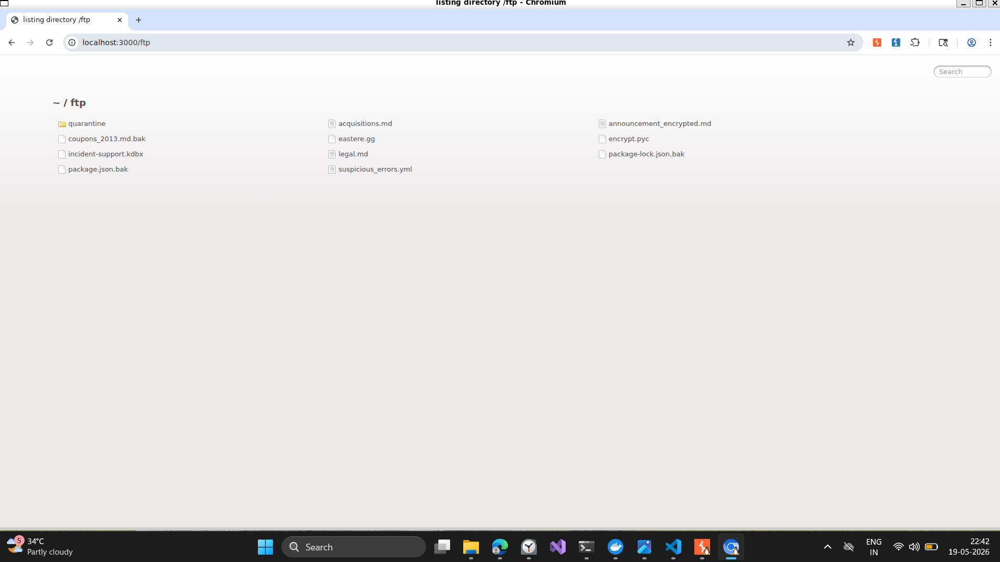

*File with potential risk:* incident-support.kdbx
kdbx files are kind of password database which stores all the credentials including database, server, instances etc. If someone access to this one, it will lead to exploitation of application server and database.

2. Encryption Keys
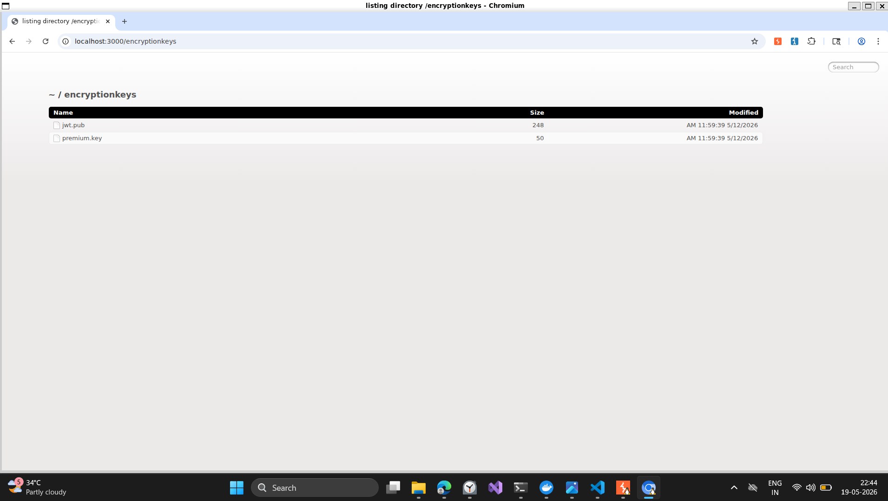

*File with potential risk:* premium.key
This seems to be the encrypted version of the private key, JWT token or some authentication method. Once decrypted, it can lead to unauthorised access.

## Supply Chain Failures ###

### Vulnerable packages ###
- sanitize-html
- express-jwt
- multer
- socket.io
- glob
- sqllite
- js-yaml
- request
- sequelize

### Outdated packages ###
- helmet
- sqllite
- sanitize-html
- eslint
- express-jwt
---

## Insecure Design ##
### Submit 12 customer feedbacks within 10 seconds ###

#### Steps to Reproduce ####
1. Send the feedback as an anonymous user
2. Fetch the cURL of the request
3. Execute it 10 times via Postman or shell script
* File for reference : `day1-owasp-workshop/script/customerFeedback.sh`
_Note: Change End of Line Sequnce to LF_

#### Execution Screenshot ####

1. Successful Response of Captcha Bypass
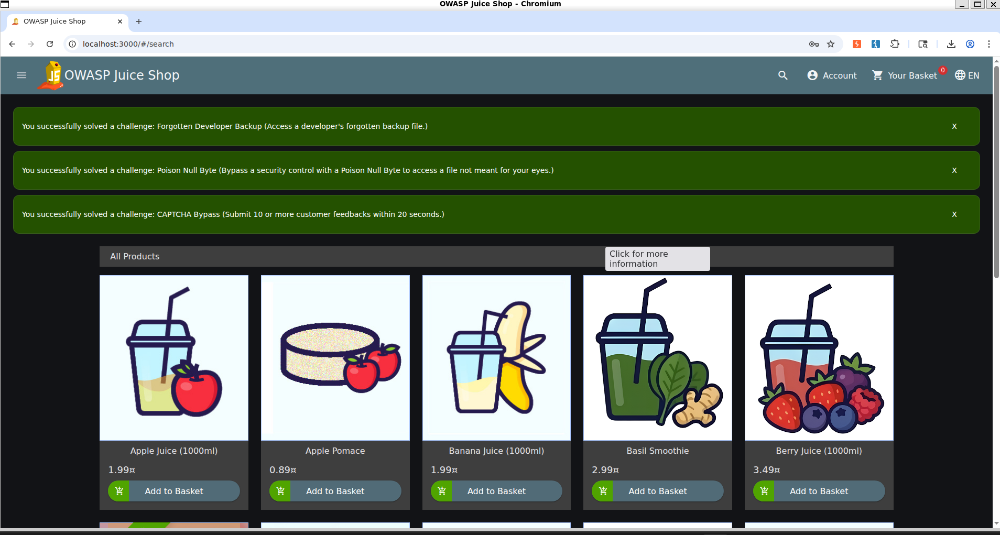

### Place an order that is not only free, but also gives you money for buying the products ###

#### Steps to Reproduce ####
1. Add a product in cart with negative quantity
2. Checkout the cart

#### Execution Screenshot ####
1. Payback Task Success
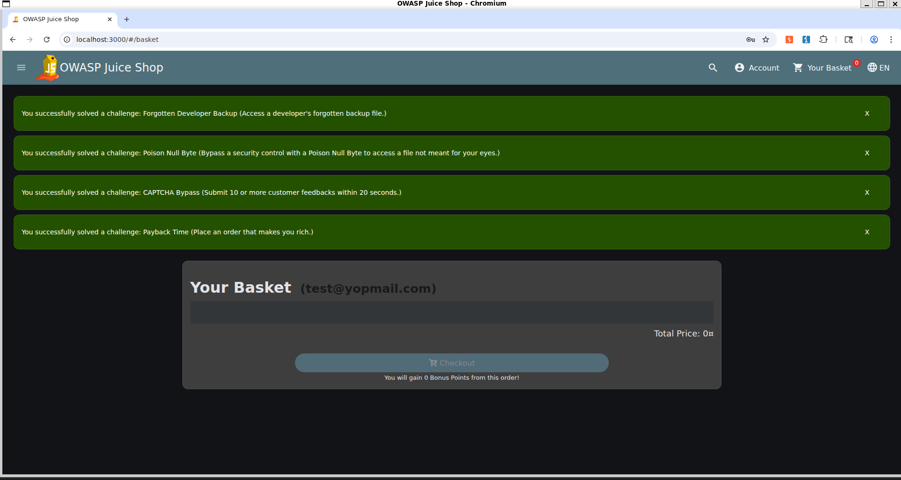

2. Order History
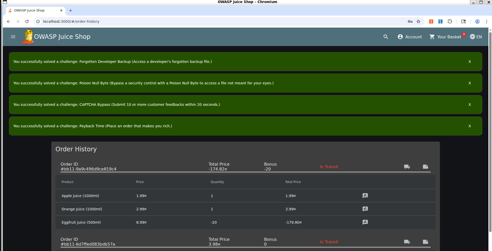
---

## Conceptual Answes ##

1. **Looking at all six vulnerability categories you explored today, which one do you think is most likely to already exist in a project you have worked on, and why? Be honest and specific.**

- I have observed the Security Misconfiguration in one of my projects where we are missed Security Configuration. The developers have missed adding nosniff in X-Content-Type-Options and same-origin for Cross-Origin-Resource-Policy. It was later fixed after the security audit. This was introduced as the emphasis is more on delivering on time, instead of delivering secure and right application.

2. **Five of the six categories (all except A03) have appeared on previous OWASP Top 10 lists. Why do these well-known, well-documented vulnerabilities keep being shipped in production software year after year? Consider the perspective of developers, testers, and management separately.**

- The sole highlight of vulnerabilities being introduced in application is the emphasis of functional deliverable more. The prime focus is always to deliver the application which meets the business requirement. The cost and efforts for the security and other non-functional requirements are often less than the functional requirements

    - Developer Perspective: Developers are more focussed to meet the functional requirements instead of focussing on the secure design and architecture. The security of the application is often compromised due to lesser priority being assigned to non-functional aspect of the application.

    - QA Engineers: Like developers, testing is always being emphasised or constrained to functional requirement instead of security testing. Security testing requires right set of tools, knowledge and time. To meet the delivery deadlines, the security concerns has always been overlooked.

    - Management Perspective: Management or Business stakeholders are mostly concern with what is operable to end users or customers. Business requirements often outweighs the security concerns when there is shorter release schedules and cost constraints.

3. **A03 (Supply Chain) and A06 (Insecure Design) are both categories where the vulnerability often exists before any functional code is written. What does this tell you about where security testing needs to start in the SDLC?**

- For the Supply Chain, the risk begins when the development team chooses third-party libraries (npm packages, NuGet packages, maven dependencies), CI/CD tool, frameworks etc. The risk introduced at this level will keep moving to the later stages of the development. Similarly, the design-level risks are being inherited to later stages. As the application progress in development, these risks and vulnerabilities will deeply embed in the system and it will also be expensive to fix. The later the stage, more the efforts and cost. As we already discussed that the security concerns are more likely to left unaddressed in the scenario where we have fast-paced delivery schedules and required business logic is pending.
It is effectient and cheap to have security testing at the earliest stage of application development.

4. **If you had to pick just three test cases to add to every project's regression suite based on what you discovered today, what would they be and why?**

- **Broken Access Control** : 
    - **Validate that any certain operation is only performed by authorised user.**
With the above failures, the attacker can gain unauthorised access to personal data or internal documents etc. This will lead to unauthorised data manipulation, integrity issues, revealation of sensitive data and failure of business logic.

- **Security Misconfiguration**
    - **Validate that all the HTTP Security Headers has the apt value to protect the application from any malicious code execution.**
    This protects the browser behaviour and prevent the attacker to utilse the browser behaviour to exploit the application

    - **Validate that no directories or file can be exposed by navigating to certain paths such as /ftp etc.**
This will block the attacker to access the confidential resources of the application such as kdbx, package.json etc.

5. **Personal reflection (5–7 sentences): What changed in how you think about testing? Which vulnerability surprised you the most and why?**

- Before learning about web application security testing, I thought testing was mainly about checking whether the application works properly. After this experience, I realized that testing is also about finding security weaknesses that could be abused by attackers. 
The vulnerability that surprised me the most was Directory and File Exposure because it can expose sensitive information very easily. I was surprised that simply accessing exposed folders or backup files could reveal important data such as source code, configuration files or internal documents. It also showed me that even a small configuration mistake can create a serious security issue.